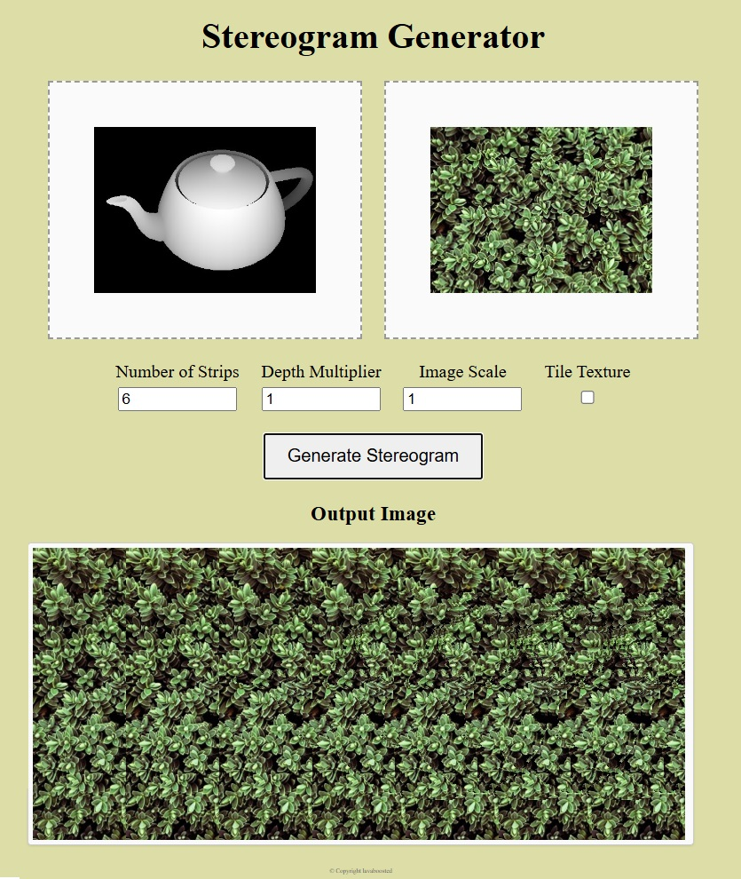
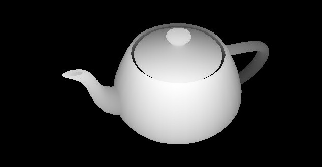
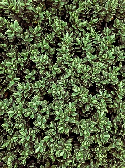

# Stereogram-Generator-Online
Generate stereograms online - Drag and drop depthmap and texture to make magic eye images online.  Allows you to make autostereograms in your browser for free.  Made by lavaboosted with p5js.

# [Give it a try here](https://ammonb.github.io/stereogram-raycaster/)

## Depth map and Texture images

Drag and drop an image or click the dropbox to upload a depthmap from your computer. 

By default the texture image will be be scaled to match the height of the depthmap image. 

If you select "Tile Texture" it will instead scale the texture image to be the width of one strip and tile it vertically. 

